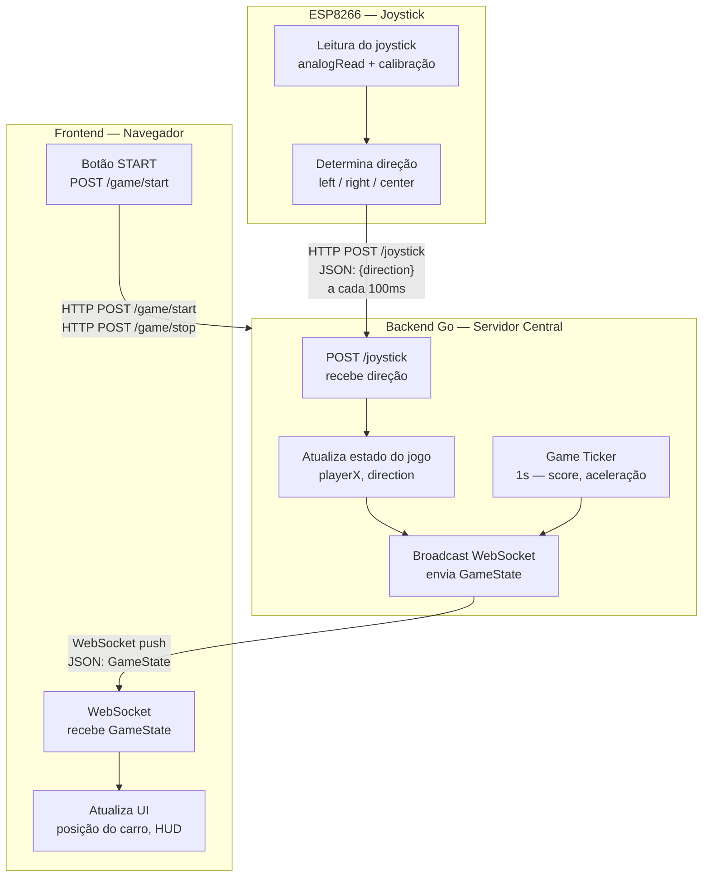

# ESP32 Game Control — Velocity Command

Jogo de navegação em tempo real controlado por um joystick físico conectado a uma ESP8266. O jogador move um carro na tela desviando de obstáculos, com dificuldade crescente ao longo do tempo.

---

## Estrutura do Projeto

```
esp32GameControl/
├── ESP32/
│   └── esp.cpp          # Firmware da ESP8266 (C++)
├── backend/
│   └── main.go          # Servidor Go (HTTP + WebSocket)
└── frontend/
    └── index.html       # Interface do jogo (HTML + JS)
```

---

## Arquitetura de Comunicação

O projeto é composto por três camadas que se comunicam de formas distintas, cada uma escolhida de acordo com as capacidades e necessidades de cada componente.

### Fluxograma



### Detalhamento dos Canais

| Canal | Protocolo | Direção | Intervalo | Motivo |
|---|---|---|---|---|
| ESP → Backend | HTTP POST | unidirecional | 100ms | HTTP stateless é simples e robusto para microcontroladores com recursos limitados |
| Frontend → Backend | HTTP POST | unidirecional | sob demanda | Chamadas pontuais de controle (start/stop) não precisam de conexão persistente |
| Backend → Frontend | WebSocket | push contínuo | por evento | O browser precisa de atualizações em tempo real sem polling; o servidor empurra o estado sempre que algo muda |

---

## Por que essa arquitetura?

### ESP usa HTTP POST
A ESP8266 é um microcontrolador com memória e CPU limitadas. Manter uma conexão WebSocket persistente em C++ seria mais complexo e consumiria mais recursos. O HTTP stateless é simples de implementar, fácil de debugar via Serial Monitor e suficientemente rápido para o caso de uso (100ms de intervalo).

### Frontend usa WebSocket
O navegador precisa refletir o estado do jogo em tempo real. Fazer polling HTTP a cada 100ms funcionaria, mas desperdiçaria requisições quando não há mudança de estado. O WebSocket permite que o backend **empurre** atualizações apenas quando necessário, reduzindo latência e overhead.

### Backend Go é o hub central
O backend desacopla completamente o controle físico da visualização:
- Recebe inputs da ESP via HTTP
- Mantém o estado autoritativo do jogo (`playerX`, `score`, `acceleration`)
- Roda um ticker de 1 segundo para atualizar score e aumentar a dificuldade
- Faz broadcast do `GameState` para todos os clientes WebSocket conectados

---

## Endpoints do Backend

| Método | Endpoint | Descrição |
|---|---|---|
| `POST` | `/joystick` | Recebe direção da ESP e atualiza posição do jogador |
| `POST` | `/game/start` | Inicia o jogo e reseta o estado |
| `POST` | `/game/stop` | Para o jogo |
| `GET` | `/game/status` | Retorna o estado atual do jogo |
| `WS` | `/ws` | Conexão WebSocket para o frontend |

---

## Payload da ESP

```json
{ "direction": "left" }
```

Valores possíveis: `left`, `right`, `center`.

## GameState (broadcast WebSocket)

```json
{
  "playerX": 225,
  "direction": "center",
  "score": 12,
  "running": true,
  "elapsedSeconds": 12,
  "elapsedTime": "00:12",
  "acceleration": 1.2,
  "playerSpeed": 24
}
```

---

## Como rodar

### Backend

```bash
cd backend
go run main.go
```

O servidor sobe em `http://localhost:8080`.

### Frontend

Abra `frontend/index.html` diretamente no navegador. Certifique-se de que a URL do backend no arquivo aponta para o IP correto da máquina onde o backend está rodando.

### Firmware ESP8266

Compile e faça upload do `ESP32/esp.cpp` via Arduino IDE ou PlatformIO. Configure o SSID, senha e IP do backend nas constantes no topo do arquivo.
