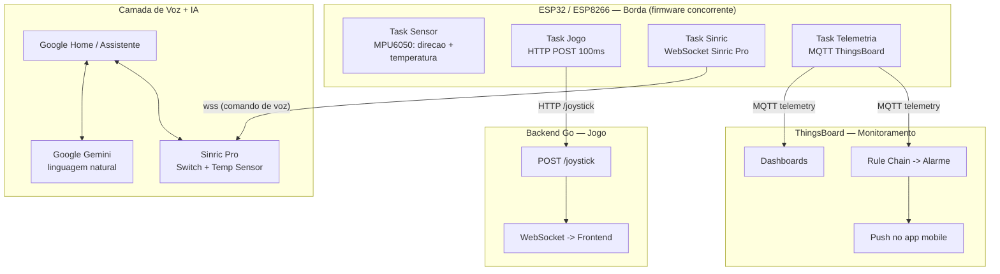

# ESP32 Game Control — Velocity Command (IoT + IA)

Jogo de navegação em tempo real controlado por **inclinação física** (MPU6050)
conectado a uma ESP32/ESP8266, evoluído para uma arquitetura completa de
**Internet das Coisas + Inteligência Artificial**: controle por **voz** (Google
Home + Gemini via Sinric Pro), **telemetria** e **alertas push** (ThingsBoard).

> Evolução do projeto da Avaliação Formativa 2: a lógica de borda foi reescrita,
> a concorrência foi introduzida, e foram adicionadas as camadas de voz/IA e de
> monitoramento em nuvem.

---

## Estrutura do Projeto

```
esp32GameControl/
├── ESP32/
│   ├── ESP32.ino        # Firmware (C++/Arduino) — ESP32 (FreeRTOS) e ESP8266 (cooperativo)
│   └── config.h         # Credenciais (Wi-Fi, Sinric Pro, ThingsBoard)
├── backend/
│   └── main.go          # Servidor Go (HTTP + WebSocket) do jogo
├── frontend/
│   └── index.html       # Interface do jogo (HTML + JS)
├── thingsboard/
│   ├── dashboard.json         # Dashboard importável
│   └── rule-chain-alerta.json # Rule chain do alarme de temperatura
└── docs/
    ├── 01-sinric-pro-google-home-gemini.md   # Setup voz/IA
    └── 02-thingsboard-dashboard-alertas.md    # Setup monitoramento/push
```

---

## Arquitetura da Solução (IoT + IA)

A ESP é o **hub de borda** e fala com múltiplos serviços ao mesmo tempo. Cada
canal usa o protocolo mais adequado ao seu papel.


```mermaid
flowchart TD
    subgraph ESP["ESP32 / ESP8266 — Borda (firmware concorrente)"]
        SENS[Task Sensor\n MPU6050: direcao + temperatura]
        GAME[Task Jogo\n HTTP POST 100ms]
        SINRIC[Task Sinric\n WebSocket Sinric Pro]
        TELE[Task Telemetria\n MQTT ThingsBoard]
    end

    subgraph Voz["Camada de Voz + IA"]
        GH[Google Home / Assistente]
        GEM[Google Gemini\n linguagem natural]
        SP[Sinric Pro\n Switch + Temp Sensor]
        GH <--> GEM
        GH <--> SP
    end

    subgraph Backend["Backend Go — Jogo"]
        R[POST /joystick]
        WS[WebSocket -> Frontend]
        R --> WS
    end

    subgraph Cloud["ThingsBoard — Monitoramento"]
        DASH[Dashboards]
        RULE[Rule Chain -> Alarme]
        PUSH[Push no app mobile]
        RULE --> PUSH
    end

    GAME -- "HTTP /joystick" --> R
    SINRIC -- "wss (comando de voz)" --> SP
    TELE -- "MQTT telemetry" --> DASH
    TELE -- "MQTT telemetry" --> RULE
```

### Detalhamento dos Canais

| Canal | Protocolo | Papel |
|---|---|---|
| ESP → Backend Go | HTTP POST (100ms) | Direção do joystick alimenta o jogo |
| Backend → Frontend | WebSocket | Empurra o estado do jogo em tempo real |
| Google Home ↔ Gemini | Nuvem Google | IA interpreta a fala em linguagem natural |
| Google Home ↔ ESP | Sinric Pro (WebSocket) | Liga LED por voz / consulta temperatura |
| ESP → ThingsBoard | MQTT | Telemetria dos sensores + gatilho de alerta |

---

## Concorrência (requisito-chave)

O firmware executa **quatro responsabilidades simultâneas** sem que uma trave a
outra (manter a conexão Sinric Pro viva enquanto lê o sensor, alimenta o jogo e
publica telemetria):

- **Build ESP32** → **tarefas FreeRTOS reais** (`xTaskCreatePinnedToCore`).
  Rede pesada (Sinric/MQTT) no core 0; tempo-real (sensor/jogo) no core 1.
  Estado compartilhado protegido por **mutex**.
- **Build ESP8266** → **escalonador cooperativo não-bloqueante** no `loop()`
  (o core Arduino da ESP8266 não expõe FreeRTOS; esse é o padrão da plataforma).

O mesmo `ESP32.ino` compila para as duas placas via `#if defined(ESP32)`.

> **Recomendação:** para a demonstração, use **ESP32** — é onde a concorrência é
> preemptiva de verdade (atende o enunciado ao pé da letra) e onde Sinric Pro +
> MQTT + jogo rodam com folga.

---

## Hardware

| Componente | Papel | Justificativa |
|---|---|---|
| **MPU6050** (acelerômetro/giroscópio) | Controle por inclinação + **temperatura** | Substitui o joystick mecânico da AF2 por sensor inercial; o registrador de temperatura (antes ignorado) agora alimenta a consulta de voz e o alerta |
| **LED onboard** (GPIO2) | Atuador controlado por voz | Demonstra "Ok Google, ligar..." sem hardware extra |

---

## Camadas e como configurar

| Camada | O que faz | Guia |
|---|---|---|
| Voz + IA | Google Home + Gemini via Sinric Pro | [docs/01](docs/01-sinric-pro-google-home-gemini.md) |
| Monitoramento | Dashboard + alerta push | [docs/02](docs/02-thingsboard-dashboard-alertas.md) |

Antes de compilar, preencha [`ESP32/config.h`](ESP32/config.h) com Wi-Fi,
credenciais do Sinric Pro e o Access Token do ThingsBoard.

---

## Como rodar

### Firmware

1. Arduino IDE → instale as libs: **SinricPro**, **ArduinoJson**, **PubSubClient**
   (o SinricPro puxa **WebSockets** como dependência).
2. Selecione a placa (**ESP32 Dev Module** ou **NodeMCU 1.0 (ESP-12E)**).
3. Preencha `ESP32/config.h` e faça upload de `ESP32/ESP32.ino`.

### Backend (jogo)

```bash
cd backend
go run main.go
```

Sobe em `http://localhost:8080`.

### Frontend

Abra `frontend/index.html` no navegador. Ajuste o IP do backend no topo do `<script>`.

---

## Requisitos do trabalho — status

| # | Requisito | Onde |
|---|---|---|
| 1 | Migração/reescrita do firmware | `ESP32/ESP32.ino` (C++/Arduino modular) |
| 2 | Concorrência (FreeRTOS / threads) | Tasks FreeRTOS (ESP32) / cooperativo (ESP8266) |
| 3 | Novo sensor/atuador justificado | MPU6050 (inclinação+temperatura) + LED atuador |
| 4 | Google Home via Sinric Pro | `docs/01` — Switch + Temperature Sensor |
| 5 | ThingsBoard: dashboard + alerta push | `docs/02` + `thingsboard/*.json` |
| 6 | Camada de IA (Gemini) | `docs/01` — interpretação de voz natural |

---

## Endpoints do Backend

| Método | Endpoint | Descrição |
|---|---|---|
| `POST` | `/joystick` | Recebe direção da ESP |
| `POST` | `/game/start` | Inicia e reseta o jogo |
| `POST` | `/game/stop` | Para o jogo |
| `GET`  | `/game/status` | Estado atual |
| `WS`   | `/ws` | WebSocket do frontend |

### Payload da ESP (jogo)
```json
{ "direction": "left" }
```

### Telemetria da ESP (ThingsBoard)
```json
{ "temperature": 28.4, "direction": "left", "accX": 1200,
  "accY": -340, "accZ": 16100, "led": true, "rssi": -57 }
```
